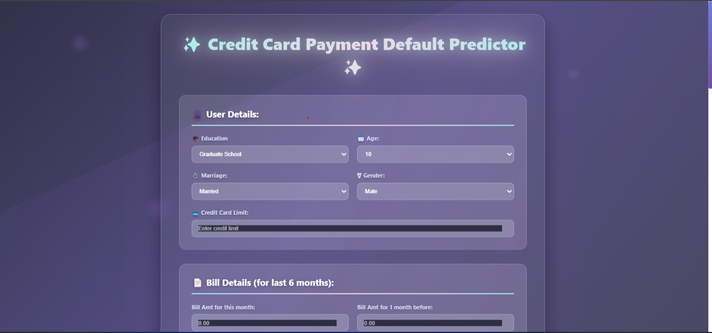

🏦 Loan Default Prediction System
## 🖼️ Project Screenshots
Here’s a preview of the live website 👇  

  

🚀 Overview

The Loan Default Prediction System is a Machine Learning-powered web application designed to predict whether a loan applicant is likely to default based on financial and personal parameters.
This project integrates a Python Flask backend (ML model) with a modern HTML/CSS/JavaScript frontend and is deployed on Render for live prediction access.

🧠 Objective

To build and deploy a web-based predictive system that:

Takes user financial data as input.

Processes it through a trained machine learning model.

Predicts the likelihood of a loan default in real time.

⚙️ Tech Stack
🖥 Frontend

HTML5

CSS3

JavaScript

🧮 Backend

Python (Flask Framework)

Pandas, NumPy, Scikit-learn

Joblib (for saving and loading model)

☁️ Deployment

Render (for hosting the web app)

🧩 Features

✅ Clean and responsive user interface
✅ Real-time ML prediction
✅ Integration between frontend & Flask API
✅ Fully deployed web app accessible via Render
✅ Easy to use and customizable

📊 Dataset

The model was trained on a Loan Default Dataset, which includes various features such as:

Applicant Income

Loan Amount

Credit History

Employment Status

Dependents

Marital Status

Education

Self Employment

Property Area

(Dataset source can be Kaggle or institution-provided — update accordingly.)

🧠 Machine Learning Model

Preprocessing Steps:

Handled missing values

Encoded categorical variables

Scaled numerical features

Model Used:

Logistic Regression / Random Forest / (mention your model here)

Performance Metrics:

Accuracy: XX%

Precision: XX%

Recall: XX%

F1 Score: XX%

Model Export:

Trained model saved using joblib.dump()

Loaded in Flask backend using joblib.load()

🌐 Web Application Flow
🔁 Frontend

User enters loan-related details in the form.

On clicking Predict Default, data is sent via fetch() to Flask API.

⚙️ Backend

Flask receives JSON input, processes it through the ML model.

The model returns a prediction result (Default / No Default).

The frontend dynamically displays the result.

🚀 Deployment (Render)

Steps:

Push your project to GitHub.

Go to Render
.

Create a new Web Service.

Connect your GitHub repository.

Specify the build and start commands:

pip install -r requirements.txt
python app.py

Deploy the application — Render will auto-generate your live app URL.

🧾 Folder Structure
Loan-Default-Prediction/
│
├── static/
│   ├── style.css
│   ├── script.js
│
├── templates/
│   ├── index.html
│
├── model/
│   ├── loan_model.pkl
│
├── app.py
├── requirements.txt
├── README.md
└── .gitignore

🧰 Setup Instructions (Local Run)

Clone this repository:

git clone https://github.com/<your-username>/Loan-Default-Prediction.git
cd Loan-Default-Prediction

Create and activate virtual environment:

python -m venv venv
venv\Scripts\activate   # Windows
source venv/bin/activate  # macOS/Linux

Install dependencies:

pip install -r requirements.txt

Run the Flask server:

python app.py

Open in browser:

https://creditcarddefaultpredictor.onrender.com/

📦 Requirements

Add these to your requirements.txt:

Flask
scikit-learn
pandas
numpy
joblib
gunicorn

🙌 Acknowledgments

Special thanks to Render for free deployment.

Libraries and frameworks: Flask, Scikit-learn, Pandas.

Inspiration: Predictive analytics in fintech and loan risk management.

👨‍💻 Author

Md Arshad Raza
🎓 B.Tech in Information Technology
📍 Rungta College of Engineering and Technology
🔗 LinkedIn Profile

